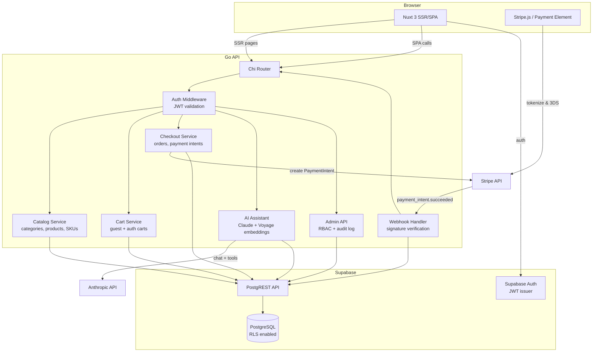
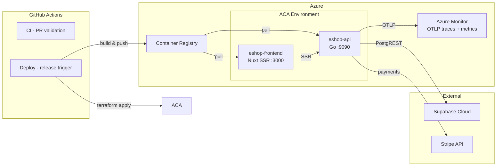

# FlexShop E-Commerce Platform

Single-tenant e-commerce platform with a flexible, category-driven product catalog, SKU variant support, server-side shopping cart, Stripe-powered checkout with 3D Secure, AI shopping assistant, and admin panel with RBAC.

## Architecture



## Deployment



## Tech Stack

| Layer | Technology |
|-------|-----------|
| Frontend | Nuxt 3 (Vue 3, Vite, Tailwind CSS) |
| Backend | Go (Chi router, Viper config) |
| Database | PostgreSQL via Supabase (PostgREST, Auth, RLS) |
| Payments | Stripe (PaymentIntent API, Payment Element, 3DS, webhooks) |
| AI | Anthropic Claude (chat + tool use), Voyage (embeddings) |
| Infra | Azure Container Apps, Terraform, GitHub Actions |
| Observability | OpenTelemetry (OTLP gRPC), Azure Monitor |

## Project Structure

```
e-shop/
├── frontend/                # Nuxt 3 app
│   ├── pages/               # File-based routing (SSR + SPA)
│   ├── components/          # Vue components
│   ├── composables/         # useApi, useCart, useCheckout, useAssistant
│   ├── server/routes/       # Nitro server routes (_health)
│   └── nuxt.config.ts
├── api/                     # Go backend
│   ├── cmd/server/          # Entry point
│   ├── internal/            # catalog, cart, checkout, assistant, admin, middleware
│   └── pkg/                 # supabase, stripe, anthropic, voyage, telemetry
├── infra/
│   ├── docker/              # Dockerfiles (api, frontend)
│   └── terraform/           # Azure Container Apps IaC
├── supabase/
│   ├── migrations/          # Schema migrations
│   └── seed.sql             # Dev seed data
├── .github/workflows/       # CI + deploy pipelines
└── docs/                    # Progress tracking, ADRs
```

## Getting Started

### Prerequisites

- Go 1.26+
- Node.js 24+
- [Supabase CLI](https://supabase.com/docs/guides/cli)
- [Stripe CLI](https://stripe.com/docs/stripe-cli) (for webhook testing)

### Setup

```bash
# Clone and copy env template
cp .env.example .env
# Edit .env with your keys

# Start local Supabase
supabase start

# Start Go API
cd api
go run ./cmd/server/

# Start frontend (separate terminal)
cd frontend
npm install && npm run dev

# Forward Stripe webhooks (separate terminal)
stripe listen --forward-to localhost:9090/stripe/webhook
```

### Run Tests

```bash
# Go API tests
cd api && go test ./...

# Frontend unit/component tests
cd frontend && npm run test

# Frontend E2E tests (requires running stack)
cd frontend && npm run test:e2e
```

### Docker (local)

```bash
# Build images
docker build -f infra/docker/api.Dockerfile -t eshop-api:local .
docker build -f infra/docker/frontend.Dockerfile -t eshop-frontend:local .

# Run API
docker run --rm -p 9090:9090 \
  -e ESHOP_SUPABASE_SERVICE_ROLE_KEY=your-key \
  -e ESHOP_SUPABASE_JWT_SECRET=your-secret \
  eshop-api:local

curl http://localhost:9090/health
```

## CI/CD

| Trigger | Workflow | What happens |
|---------|----------|-------------|
| PR to main | `ci.yml` | Go tests, frontend tests, Docker build, Terraform validate |
| Pre-release | `deploy.yml` | Test, build, push to ACR, deploy to **staging** |
| Full release | `deploy.yml` | Test, build, push to ACR, deploy to **production** |
| Manual | `deploy.yml` | Choose environment + optional image tag via Actions UI |

### Required GitHub Environment Config

Both `staging` and `production` environments need:

**Secrets:** `AZURE_CLIENT_ID`, `AZURE_TENANT_ID`, `AZURE_SUBSCRIPTION_ID`, `SUPABASE_SERVICE_ROLE_KEY`, `SUPABASE_JWT_SECRET`, `STRIPE_SECRET_KEY`, `STRIPE_WEBHOOK_SECRET`, `ANTHROPIC_API_KEY`, `VOYAGE_API_KEY`

**Variables:** `RESOURCE_GROUP_NAME`, `ACA_ENVIRONMENT_NAME`, `ACR_NAME`, `ACR_LOGIN_SERVER`, `MANAGED_IDENTITY_NAME`, `SUPABASE_URL`, `SUPABASE_ANON_KEY`, `STRIPE_PUBLISHABLE_KEY`, `OTLP_ENDPOINT`
