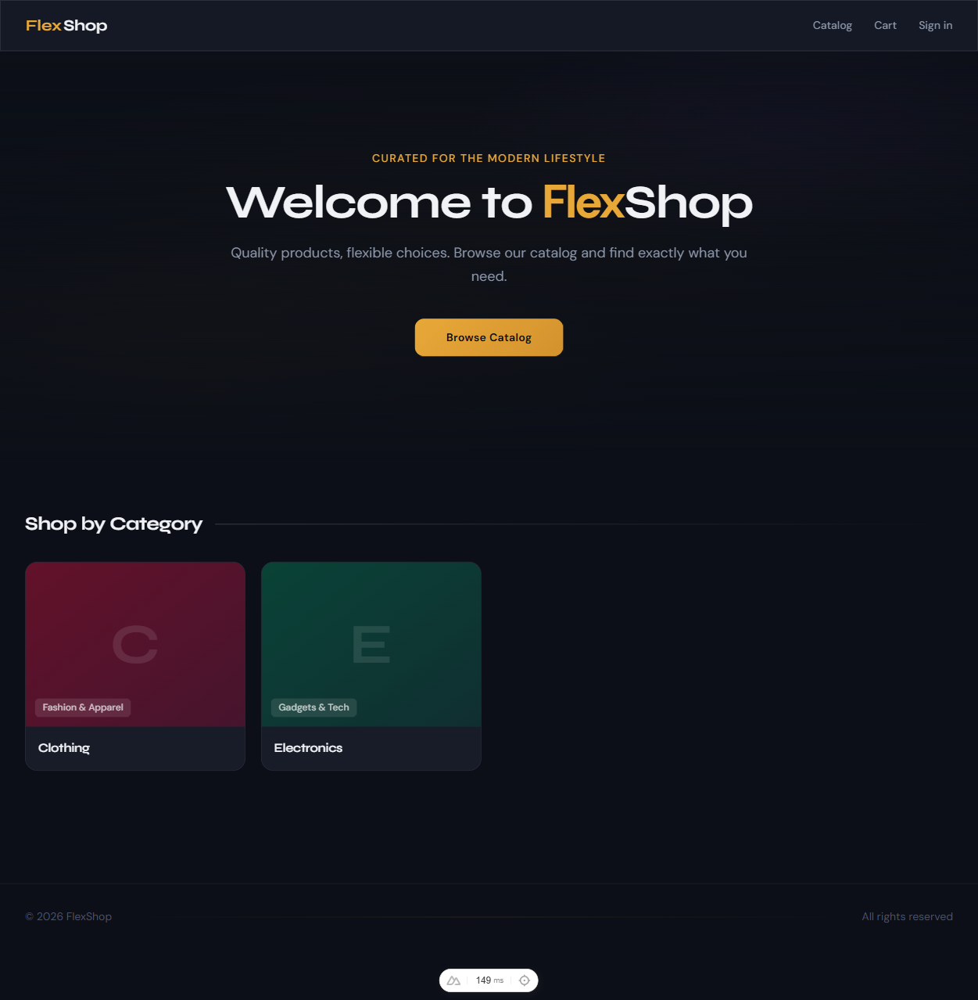
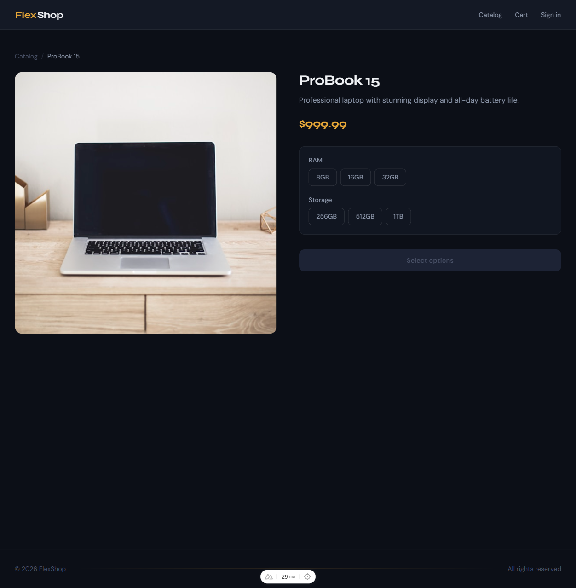
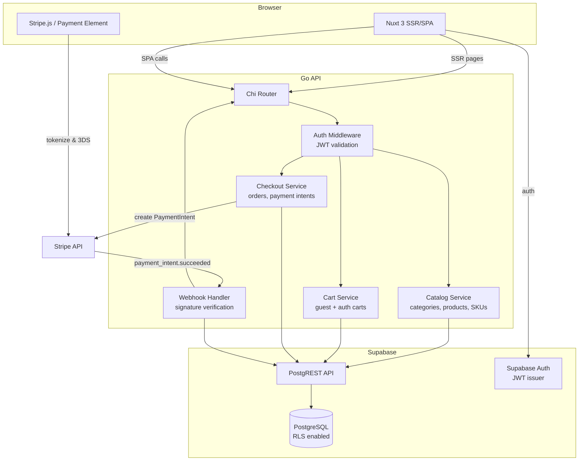

# FlexShop E-Commerce Platform

Single-tenant e-commerce platform with a flexible, category-driven product catalog, SKU variant support, server-side shopping cart, and Stripe-powered checkout with 3D Secure.

## Screenshots

<p align="center">
  
</p>
<p align="center"><em>Homepage — dark hero with gradient mesh and category cards</em></p>

<p align="center">
  
</p>
<p align="center"><em>Product detail — SKU variant selector with amber accents</em></p>

## Architecture



## Tech Stack

| Layer | Technology |
|-------|-----------|
| Frontend | Nuxt 3 (Vue 3, Vite, Tailwind CSS) |
| Backend | Go (chi router) |
| Database | PostgreSQL via Supabase (PostgREST, Auth, RLS) |
| Payments | Stripe (PaymentIntent API, Payment Element, 3DS, webhooks) |

## Project Structure

```
e-shop/
├── frontend/              # Nuxt 3 app
│   ├── pages/             # File-based routing (SSR + SPA)
│   ├── components/        # Vue components
│   ├── composables/       # useApi, useCart, useCheckout
│   └── nuxt.config.ts
├── api/                   # Go backend
│   ├── cmd/server/        # Entry point
│   ├── internal/          # catalog, cart, checkout, middleware
│   └── pkg/               # supabase client, stripe client
├── supabase/
│   ├── migrations/        # Schema migrations
│   └── seed.sql           # Dev seed data
└── docker-compose.yml
```

## Getting Started

### Prerequisites

- Go 1.22+
- Node.js 18+
- [Supabase CLI](https://supabase.com/docs/guides/cli)
- [Stripe CLI](https://stripe.com/docs/stripe-cli) (for webhook testing)

### Setup

```bash
# Start local Supabase
supabase start

# Start Go API
cd api
export SUPABASE_SERVICE_ROLE_KEY="<from supabase start output>"
export SUPABASE_JWT_SECRET="<from supabase start output>"
export STRIPE_SECRET_KEY="sk_test_..."
export STRIPE_WEBHOOK_SECRET="whsec_..."
go run ./cmd/server/

# Start frontend
cd frontend
echo "NUXT_PUBLIC_STRIPE_KEY=pk_test_..." > .env
npm install && npm run dev

# Forward Stripe webhooks (separate terminal)
stripe listen --forward-to localhost:9090/stripe/webhook
```

### Run Tests

```bash
cd api && go test ./...
```
